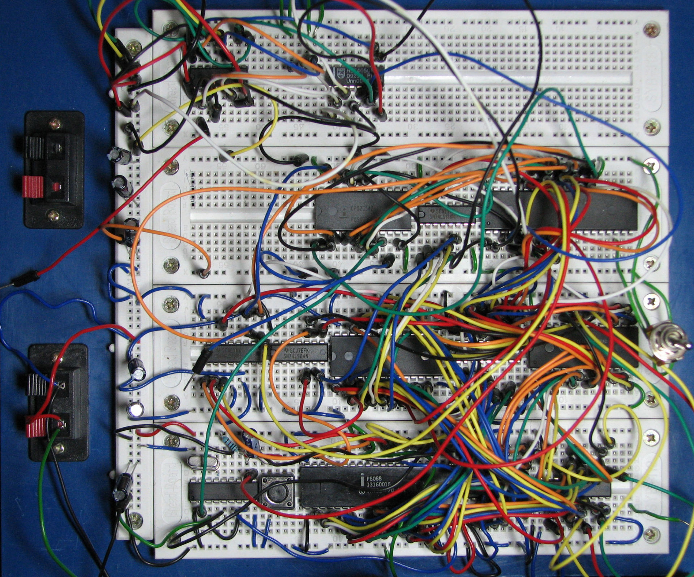

#Beyond the Slab

<sub>(or, stuff i've learned getting into hacking hardware)</sub>

---
#[fit]👋 who am i?

^5min

---


---


#1997😂

---

#[fit]I've been writing software for around 20 years. 
 
---

* I've been writing software for around 20 years. 

##[fit]I started on the Web when it was a baby
 
---

* I've been writing software for around 20 years. 
* I started on the Web when it was a baby

###[fit]When we used to build our web browsers each new version 
####(using ```make``` not homebrew ;-)


 
^And website would always greet one with "Welcome"

---

I was introduced to embedded computing working for a Major Appliance Manufacturer in their research lab.


---

###I've been in the Nordstrom Innovation Lab for about 3 years. 
We focus on testing things that the business may find risky, and often try to do it fast. This means we get to play with^H^H^H^H^H^H^H^H^Htest cool^H^H^H^H^H^H^H^H^Hnascent technologies and processes every now and then in order to get there.


^we've gone through a few iterations over the years, but basically -- we prototype a lot, whether it be processes, customer experiences, or technologies. We've failed a lot, and have been quite successful and influentual throughout the business.

---

I picked up an Arduino for my kid at Christmas a few years back, thinking we'll learn it together, and i could also try some things out at work. Then started. We blinked an LED or two, then stopped.

^I watched colleagues hack hardware for various experiements, then finally had an opportunity to try it out for a project. I'll talk about that briefly later.

---

#Then someone asked me to dim a light.

^Yeah, i'm still a beginner.

---

#Why do we do it?
^Why do people spend time hacking hardware?

---

### Prototyping is old news, but the ability to easily write software to our electronics, and cheap cost expanded the 	capabilities of prototyping many-fold
  


^We're nearly only limited by our imagination when it comes to the ideas we can actually test! It's never been easier to go from "wouldn't it be cool if" to "let's see if it really would be cool", or "i wonder if we can" to "yeah we can!"

---


###Escape from Terminal World -- remove the constraint of the glass slab to solve problems

^Not every problem has a solution that requires a generic hand-held device to solve. 

---


(there can be no app for this)


^imagine if this dude had to pull out his mobile device, open up the OrcSensor app, hope he has his network turned on inside the dingy cave, to look up the database of locations where orcs could be. maybe he was listening to music for a while and the battery's nearly dead?

---


##Prototype your enchanted objects!

---

##We're talking about Physical Computing. 
###What is it?

^10mins

^So, what are we talking about here? Physical Computing Platforms

^First a side note--How powerful are these boards? They are 4~16 times more powerful than the initial IBM PC, and 16~64 times more powerful than the Apollo 11 computer! (http://embeddedcomputing.weebly.com/)

--- 

Arduino
Tessel
Raspberry pi
Beaglebone
Spark Core
LightBlue Bean
Twine
Those TI sensor demos we got from em
Beacons (Bluetooth)
  generic
  Estimote

---


###Classes of devices
* "classic" Platforms (Arduino & variants)
* "mini computers” (BeagleBone, Raspberry Pi series )
* wireless platforms (spark core, lightblue bean, twine)
* Language-specific boards (Tessel)

^Classic platforms don't have a full-on computer, but support pushing code to the device. They also are usually modular, and support, in the case of Arduino, shields, and other more full-featured modules. Arduino is important because: 1) it's the one that broke out this movement of hardware hacking for the masses 2) The hardware spec is Open Source, which has led to quite a bit of innovation in the space.

^Mini Computers like BeagleBone, Raspberry Pi series, can run a 3rd party operating system (ChromeOS, Linux, whatever you can stick on it) usually have USB ports, maybe ethernet, and a HDMI output built-in. They're pretty cool because You can do stuff like maybe set up a little database on it, and a web server, or any other thing that a "regular computer" can do (albeit slower of course)

^Sensor based -- vendors have tried to add value by creating devices with sensors in them (mainly because they can). stuff like accelerometers, maybe a light sensor...and many of them support loading programs onto them without having to be tethered. Two mentioned have GPIOs, the Twine (to my current knowlege) has no GPIO, but supports proprietary modules

---

* beacons? (Estimote,Motorola,)
* programmable toys (sphereo, not in scope for this discussion)

---

^beacons are an entirely separate discussion. :)

^sphereo and the like are toys that do a prescribed set of stuff, and have APIs available. The geekiest among us have taken them apart and augmented their functionality, however, sometimes using some of the above platforms. :)

---

###Necessary Skill Sets


####The Basics:

* Computer hacking skills
* Desire skills
* Google skills
* Asking for help skills

^I can't stress enough -- if you can find someone who knows this stuff, even if they don't know it thoroughly, and you can pair/work through it together, it makes a big difference.

---

###Concepts/Considerations 

^25mins

^Power: voltage (V), current (I, uppercase "i") and resistance (r).

---

#The key to a legit board -- __GPIO__


<sub>General Purpose Input/Output</sub>
<sub><sub>(anyone remember the BeBox? GEEKPORT!)</sub></sub>

^GPIO is the thing that allows you to talk to the various components you'll end up spending your money on. It separates the sensor-based

---


###Components/Modules--They works kinda like software
* Components follow composition. 

---


###Components/Modules--They works kinda like software
* Components follow composition. 
* Components have interfaces

---


###Components/Modules--They works kinda like software
* Components follow composition. 
* Components have interfaces
* Some larger components have are standardized, some aren't

---

###Components/Modules--They works kinda like software
* There are a lot of larger components available, and many of the platforms have libraries to interface with these (cameras, servos, sensors, advanced controllers)
* Design, Run, Refactor


^As in software, or just about anything, hardware consists of components. You've seen these, they usualy make up other components. The space is vast enough these days that you'll spend a lot more time dreaming up your idea than doing complex wiring to create a component from scratch (unless that's your thing--then go for it!). 

^Each of these components have interfaces to make them *do* something. Much of the time they're standard, but, like in the software world, there are deviations due to varying factors (companies trying to differentiate themselves, skill levels of component makers, opinions of component makers). The specification documentation is your friend! 

^As with software, you'll design your prototype (usually using drawings/schematic), run it, and learn & refactor your design.

---

#Hardware is different than software...
* Instead of pushing bits, you're pushing volts

---

#Hardware is different than software...
* Instead of pushing bits, you're pushing volts
* It's slightly scarier than software, because you can blow something up.

---

#Hardware is different than software...
* Instead of pushing bits, you're pushing volts
* It's slightly scarier than software, because you can blow something up.
* But most parts are kinda cheap these days

---


#[fit]And heck, you can even use that fact to your advantage.

---

#Hardware is different than software...
* Testing *seems* more functional (at least I haven't found a good way to "unit test" components well)
* Things you'll want that'll be helpful

^i'm talking pennies

---

#Interface Design - Hardware

* Who or what is consuming?

^Sometimes a human will be touching it directly, sometimes it's another system. It's the same with software, so think about that. Granted its more likely when you're prototyping you want someone to play with what you built, so this is when it's useful to maybe study other designs, and even pair with an Industrial designer (or someone with that background) to chat about this stuff (they're easier to find than you think...well for me?:) -- at least you now know what to Google.

^With any prototyping, there's a question of fidelity...there are plenty of things you can just throw together (like for todays demo ;-) or you'll need to put something together to put in front of customers to test. [some rules of thumb here--talk to UX folk]

---

#Interface Design - Hardware

* Who or what is consuming?
* How much coupling can you tolerate?

^Sometimes a human will be touching it directly, sometimes it's another system. It's the same with software, so think about that. Granted its more likely when you're prototyping you want someone to play with what you built, so this is when it's useful to maybe study other designs, and even pair with an Industrial designer (or someone with that background) to chat about this stuff (they're easier to find than you think...well for me?:) -- at least you now know what to Google.

^With any prototyping, there's a question of fidelity...there are plenty of things you can just throw together (like for todays demo ;-) or you'll need to put something together to put in front of customers to test. [some rules of thumb here--talk to UX folk]

---

#Interface Design - Software

* Who or what is consuming?
* Will it need a visually compelling front end? or data?
* HTML, Mobile native?
* JSON (call out some emerging formats for M2M communication)

---


#Want to see something IRL?

^Let's take a look at this light dimmer.

---

#Other ways I could have done it

---


    Composition
         Hardware/software same/different
              building blocks
              components/modularity
              designing/doing/refactoring loop
              Interface design
                   hardware interface
                        who or what is consuming?
                        how much coupling can you tolerate?
                   software interface
                        who or what is consuming?
                        will it need a visually compelling front end? or data?
                             HTML, Mobile native?
                             JSON (call out some emerging formats for M2M communication)

    Let’s put something together/examples
         Hello world: LED blinker
              LED blinker respond to accelerometer?
         Servo/PWM example
         relay example
         camera exmple
         lillypad/clothing example?

Deployment
	ATTiny

---

####Things that will learn, and will become more important
* Schematics
* Stuff like reading resistors
* Component foo
  * diodes, capacitors, all that jazz, and why they're important (hint: many of them stop your electricity from going haywire)

---
####Buying Guide 5mins
   Desired capabilities
     Wifi? 
     Phone interface? 
     Portability?
   Complexity 
      Similar concepts to software--MVP, refactoring, scaling, performance considerations

    considerations
    power requirements
     


Resources/Q&A

