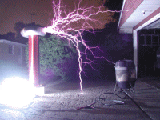
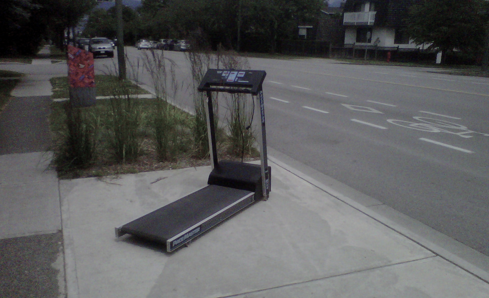
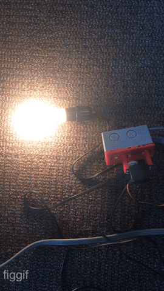
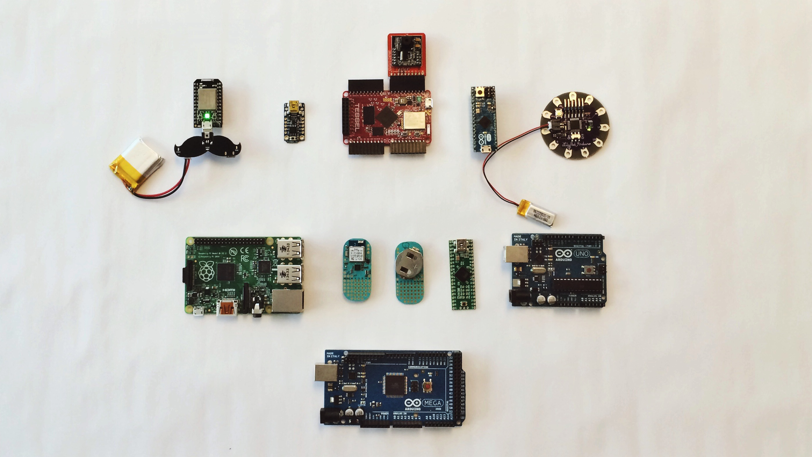
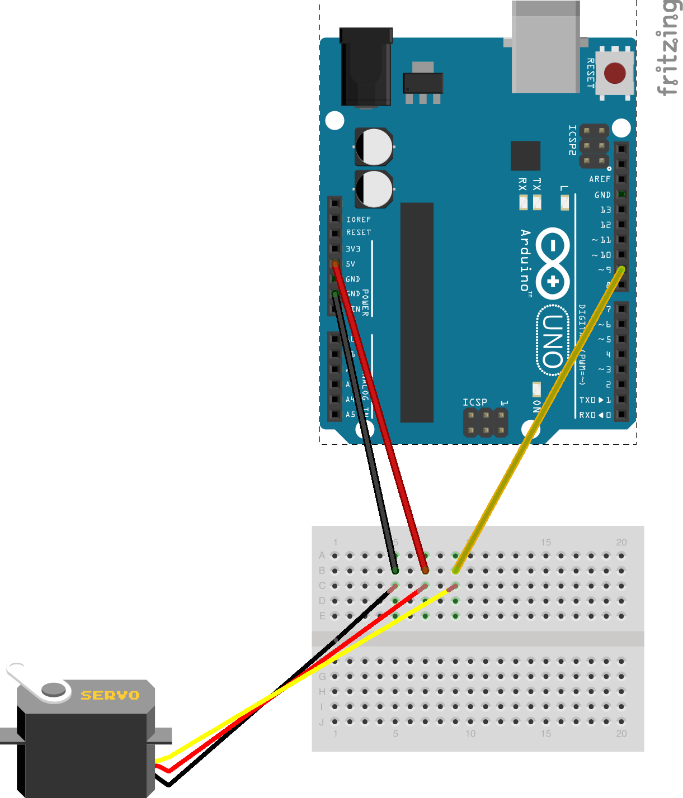
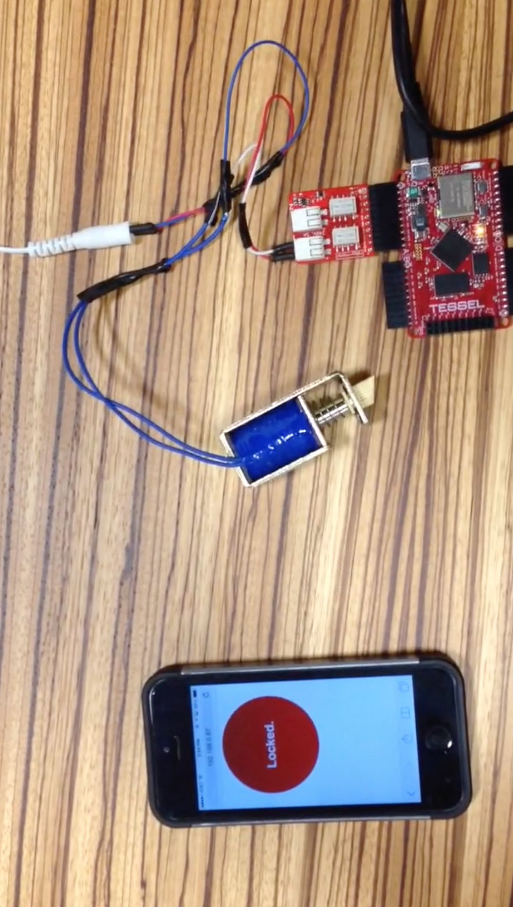
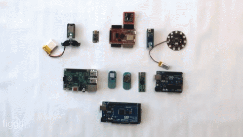

#_Beyond the Slab_

_(or, a beginner shares a little of what he knows regarding hardware hacking)_

^0-5min (5mins)

^Today, I hope to do three things:

^Share a little of my experiences as a software dev being first afraid,  then turned onto hardware hacking

^Convince my fellow software developers that hardware hacking is a necessary endeavour

^Give my fellow software devs some resources to get started.

---
#[fit]👋 who am i?

---


^I'm obviously jm, owner of beats.com and I hold a title of webmaster of Golden Dome Productions in South Bend Indiana

---


#1997😂

^Just kidding, this was from 1997. 

---


#[fit]_and yes, i did own, and subsequently sold beats.com in the early 2000s._

^And yes, i did own, and subsequently sell beats.com, back in the day. T.T

---


#[fit]_and yes, i did own, and subsequently sold beats.com in the early 2000s._
#😭


---


#[fit]I've been writing software professionally for over 15 years. 
 
^I've spent most of my time writing software that runs on the Internet, whether it be CGI in with C then  Perl, Java, Shell scripts, Javascript...I worked for a few years at an e-commerce startup, which eventually brought me to Seattle. 

---

#I was introduced to embedded computing working for a Major Appliance Manufacturer in their research lab.


^We used Java + OSGI bundles back then.

---

##_I've been in the Nordstrom Innovation Lab for about 3 years._ 
_We focus on testing things that the business may find too risky to spend a lot on up front, and often try to do it fast._ 

_This means we ~~get to play with~~ test ~~cool~~ nascent technologies and processes every now and then in order to get there._


^We've gone through a few iterations over the years, but basically -- we prototype a lot, whether it be processes, customer experiences, or technologies. We fail often, to learn, to succeed.

^I currently spend most of my time writing code in Javascript, and Objective-C. I've recently started teaching Python so i figured i should learn it as well. We'll actually see a little code here today; it'll be in Javascript, so feel free to head out if this offends. :)

---

_I picked up an Arduino for my kid at Christmas a few years back, thinking, "we'll learn it together", and that i could also try some things out at work._


---



#_We started!_

---



_Actually, we blinked an LED or two, then stopped. I was done._

---


##Then, at work, someone asked me to dim some lights.

^I'd watched in wonder as colleagues hacked hardware for experiements, then finally had an opportunity to try it out for a project. I'll talk about that in a second.

^First, a disclaimer: I'm a rank amateur when it comes to hardware hacking, but I do enjoy it, and am thankful that I'm lucky enough to play with hardware at work.

---

#Why hack hardware?

^5-8mins (3mins)

^Why would someone want to spend time hacking hardware?

---

###Because, it's not that hard anymore, and actually fun
  


^Electronics prototyping's been around for a while, but there are a couple of things that have helped make prototyping blow up!

---

#Why is this space blowing up?

1. _Arduino and friends. These platforms have made it so easy to write software to our electronics. Hardware's more malleable than ever_

1. _Support for higher level languages. We're no longer speaking the language of the "Metal", but in languages in which we're already productive_

1. _It's less expensive to prototype electronics than in the past_

^So, why is this space blowing up? Among other reasons, here are three:

^-Arduino 

^-Higher Level Language Support

^-Cost

^It's never been easier to go from 

^"wouldn't it be cool if" to 

^"let's see if people really think it's cool", or 

^"i wonder if we can" to 

^"let's try and build it and see!"

---


##_The Landscape_
###_What's available?_

^8-13mins (5mins)

^I want to take a few minutes to talk about the landscape. What's available out there for us? The field seriously has blown up. Here's a short list...

--- 

##Here's a short list
_Arduino: Uno,Nano,LillyPad,Duemilanove,..., Beaglebone, Beaglebone Black, ChipKit, Edison, LightBlue Bean, LPCXpresso, Netduino (.Net Micro Framework!), Parallax Propeller Activity Board, Raspberry Pi, Raspberry Pi B, Seeed Linkit (GPRS even!), Spark Core (OTA programming), Tessel, Teensy, TI LaunchPad, Trinket, Twine, Beacons (Bluetooth)_

^There are so many boards to choose from, and they're all not Arduino.:) Depending on what you want to prototype, you may want a little more to start with, or want a form factor that will work better with what you're doing.

---


###_Kinds of devices_
* _Microcontrollers (Arduino & variants)_
* _"Tiny computers” (BeagleBone, Raspberry Pi series)_
* _Wireless microcontrollers (Spark Core, Lightblue Bean)_
* _Language-specific boards (Tessel,Netduino)_
* _Specialty Boards (LillyPad Arduino)_

^There are quite a few kinds of devices. 

^Microcontrollers allow a developer to push code onto it. They don't have all the facilities of a full computer, but are the basis of most of this stuff.

^Mini Computers like BeagleBone, Raspberry Pi series, can run a 3rd party operating system (ChromeOS, Linux, whatever you can stick on it) usually have USB ports, maybe ethernet, and a HDMI output built-in. They're pretty cool because You can do stuff like maybe set up a little database on it, and a web server, or any other thing that a "regular computer" can do (albeit slower of course)

^Wireless microcontrollers allow you to program them remotely, using either Wifi or Bluetooth LE in the case of the Bean

^Specialty Boards like the LillyPad Arduino was specifically made so that it can be sewed onto garments, and is purportedly washable

---

###_Necessary Skill Sets_

 
* _Computer hacking skills_
* _Desire skills_
* _Google skills_
* _Asking for help skills_

^What level developer do you need to be? What skills should i posess?

^Desire -- my hope is that this talk will get you interested enough to want to grab a board and play with it

^Google skills -- Knowing what to ask is always helpful. The more you tinker, the more you'll know what to ask

^I can't stress enough -- if you can find someone who knows this stuff, even if they don't know it thoroughly, and you can pair/work through it together, it makes a big difference.

^I have found that the folk that you usually want to talk to about this, are so into it, that they *love* to talk about this stuff anyway!

---

So, wanna see something IRL?


^13-28mins (15mins)
^So, back to the light dimmer. I got a request to do some kind of automatic dimming of a light when someone walked into a room.

^Yeah we coulda purchased a Phillips Hue system, but we weren't sure if we wanted to do this. This was an opportunity to build to learn. So, like macguyver, we were like "lightbulb, dimmer, arduino, what can we do". 

^I have the luck to share the lab with an industrial designer, and an electric geek, so they were able to help me wire a dimmer, and create a simple case that would mount a servo on a dimmer to turn it, like a baby robot!

---


<sub>https://github.com/jonmadison/arduino-servo-control</sub>

```javascript
var five = require("johnny-five"), 
    board = new five.Board();
var program = require('commander');
var keypress = require('keypress');

program
  .version('1.0.0')

board.on("ready", function() {
  console.log("board ready. left right arrow keys, 'q' to quit.");
  var servo = new five.Servo({
    "pin": 9,
    "startAt":program.startAt
    });
  process.stdin.on('keypress', function (ch, key) {
    // console.log('got "keypress"', key);
    if (key && key.name == 'right') {
      servo.to(0);
    }
    if (key && key.name == 'left') {
      servo.to(180);
    }
    if(key && key.name == 'q') {
      process.exit(0);
    }
  });

  process.stdin.setRawMode(true);
  process.stdin.resume();
});
```

^You'll be using a breadboard for most of your projects. Don't worry--if you order a "Kit", you'll get most of what you need to get started.

^I used a library, Johnny Five, which allows us to talk to Arduino via Javascript. As you can see, the code is pretty simple (and is on my GitHub if you want to grab it).

^This is an interactive version of a program that I ended up "scriptifying" it by using a command line library, so another process could initiate it.

---

#Other ways I could have done it
* _Work directly with AC to dim the light switch_
* _Used LED Lighting, MOSFET or somesuch to boost electricity needed_

^A quick note--Most of the work you'll do in the beginning will be affecting Direct current. I had a colleague explain to me how I had to write to the arduino to affect the AC of the lighth bulb, and it was a bit more complicated than I wanted to do for a first project. 

^That said, I could have found some 12VDC LED Lighting. It's a little easier to handle, and probably visually would have given me a more dramatic dimming effect.

^In the end, it was fun to come up with a baby robot.

---

#Door Unlock Mechanism--from legit schematic to project
* _12VDC Solenoid_
* _12V Power supply_
* _Relay to condition our power from the Arduino's 3.3V to 12V_


^Let's look at another example of something built with another board, the Tessel.

^The thing with BCE is a transistor, 

^The zigzags are resistors, and 

^The curlycue is a solenoid, with a diode thrown in so that things don't spark when we throw power at the diode. 

^That's the part I messed up. I think i used too small of a diode or somesuch. 

^Then i realized I was trying to build a door switch, and not reinvent the relay. 

^So I bought a relay module for the Tessel.

---


```javascript
var router = require('tiny-router'),
    tessel = require('tessel'),
    relaylib = require('relay-mono');

var relayOpenDefault = 3000;
       
var relay = relaylib.use(tessel.port['A']);  

[...]

relay.turnOn(1,function turnOnResult(err){
  [...]
}

[...]

relay.on('ready', function relayReady () {
    router
        .get('/unlock',function(req,res) {
                unlock(req,res,relay);
        });

    router.use('static', {path: __dirname + '/public'});

    setTimeout(function(){
        router.listen(80);
    },5000)
});
```

^I'm gonna talk about the Tessel for a second.

^Tessel is cool in that it runs javascript. I know javascript! 

^You want to keep your code pretty small, but still quickly get work done, so i used a tiny-router module to expose endpoints that would do the main function of unlocking.

^I declare my relay class with the relaylib line, it emits 'ready' when ready, and then i set up my endpoint. When it comes time to turn on the relay, the API is super straightforward: relay.turnOn()

^Note the static path. The UI front end you see is a web page with a little Javascript to make an Ajax call to this web service.

---



```javascript
<html>
  <head>
  <meta name="viewport" content="width=device-width, initial-scale=1.0, maximum-scale=1.0, user-scalable=no" />
  <meta name="apple-mobile-web-app-capable" content="yes">
  <link rel="stylesheet" href="/css/main.css">
  <link rel="stylesheet" href="/css/rad.css">

  <title>Unlock this door</title>
  </head>
  <body>
    <div class="container">
      <div id='radial-progress' class="progress-radial progress-step-0">
        <div class="overlay" id="radial-progress-overlay" onclick='runProgress()'>locked</div>
      </div>
    </div>
  </body>
</html>
<script type='text/javascript'>
  var relayOpenDefault = 4000;
  var setProgress = function(element,i) {
    // console.log("set progress: " + i);
    var progress = document.getElementById('radial-progress');
    var progressMessage = progress.children[0];
    if(!(i%5)) {
      progress.className = 'progress-radial progress-step-' + i;
      // progressMessage.innerHTML = i + '%';
    }
    if(i>=100) progressMessage.classList.add('complete');
  }

  var runProgress = function() {
    resetProgress();
    var i = 0;
    var progress = setInterval(function(){
      setProgress('progressbar',i++);
      if(i == 101) {
        clearInterval(progress);
      }
    },1);          
  }

  var resetProgress = function() {
    var progress = document.getElementById('radial-progress');
    progress.className = 'progress-radial progress-step-0';
    var progressMessage = progress.children[0];
    progressMessage.classList.remove('complete');
    progressMessage.innerHTML='locked';
  }

  xmlhttp=new XMLHttpRequest();
  xmlhttp.onreadystatechange=function()
  {
  if (xmlhttp.readyState==4 && xmlhttp.status==200)
    {
      var progressMessage = document.getElementById('radial-progress').children[0];
      progressMessage.classList.add('complete');
      progressMessage.innerHTML=xmlhttp.responseText;
      setTimeout(function(){
         resetProgress();
      },relayOpenDefault)
    }
  }
  var unlockDoor = function() { 
    runProgress();

    document.getElementById("radial-progress-overlay").innerHTML='...';
    xmlhttp.open("GET","/unlock",true);
    xmlhttp.send();
  }

  var el = document.getElementById('radial-progress-overlay');
  el.addEventListener('click', unlockDoor, false);
  el.addEventListener('touchstart', unlockDoor, false);
</script>
```

^I used Good Old Fashioned Javascript (no fancy libraries) for the front end, to keep it as lean as i could. It's messy, and could use some refactoring, surely, but remember: PROTOTYPE :)

---

#Other ways I could have done it
* _Use Raspberry Pi or BeagleBone, add a DB to store/sync unlock codes with a central service_

^I haven't tried sticking a DB on one of these yet, so dunno about performance. Furthermore, the tessel could have made external calls to a service for this functionality as well

---

#Other ways I could have done it
* _Use Raspberry Pi or BeagleBone, add a DB to store/sync unlock codes with a central service_
* _Use Bluetooth module instead of Built-in WiFi_ 

^I could have tried the Bluetooth module, but i was cheap, and in learning mode (since then i've acquired the BTLE module :-)

---

#Other ways I could have done it
* _Use Raspberry Pi or BeagleBone, add a DB to store/sync unlock codes with a central service_
* _Use Bluetooth module instead of Built-in WiFi_ (but i was cheap, and in learning mode)
* _These other ways depend on what i was trying to accomplish..._

^Which leads me to...

---


#Refining your Prototype
* _Who is your audience?_
* _Where will it live?_
* _How much more time do you have?_
* _Is Duck tape GEFN?_
* _Often, you'll want to move to PCB while you're still prototyping_

^28-35mins (7mins)

^You'll want to think about your audience when you decide whether or not to refine your prototype. 

^In our case, for the Light Bulb, we wanted people to kind of hear the servo (for whatever reason we thought that was cool), but wanted to hide some key pieces to not make it look too shoddy. 

^We also didn't want to cause an accident in front of our audience, so it was important to encase the dimmer in the proper enclosure!

^3D printing is a fantastic luxury for helping you shape up your prototypes.

^There are services that will help you get from prototype to batch production, when you're ready.

---


####Things that will learn along the way, and will become more important
* _How to draw and read schematics_
* _Shields_, _Capes_, _Plates, oh my (also, Modules)_
* _Component foo_
  _<sub>capacitors, diodes, resistors, MOSFETs, all that jazz, and why they're important. You'll run into some earlier than others.</sub>_
* _How to make your creation self-contained_
  * _Look into ATTiny_
  * _External Power Supplies_

---


#My recommendations 👍
* Grab an Arduino (Uno or Mini) _Kit_  to start
* Grab a Raspberry Pi or a Tessel -- you'll start to take your creations "off the screen"
* Find a local group!
* Ask for help

^Grab an Arduino (Uno or Mini) _Kit_  to start. Kits usually come with breadboard,LEDs,few other components, and usually a book
^Maybe Try out TI Launchpad. TI has a habit of providing samples for free, because they love eventually selling in bulk
^If you're into Javascript, grab a Tessel. It's my current personal favorite because of the built in Wifi, and modules. It's just easy quick to get stuff running on it.
^There's a board (and/or module) that'll give you the size and features you need.
^There are several "maker" meetups in the area, and places in the area to go and build. You'll want to look up "Maker spaces"

^I can't stress this enough. As you're learning this you're going to have questions of feasibility. The answer, as in software, is usually "yes, with tradeoffs" :) but having someone that knows the electronics space can help you get unstuck quicker than yourself.

---

#Resources
* _Learning Stuff: www.allaboutcircuits.com_, _Youtube, duh_
* _Buying stuff: _Adafruit_, _SparkFun_, _Seeed Studio_
* _Metrix Create Space_
* _Ada Technical Books_
* _http://iot.ieee.org/_

^"Make" has a great Youtube channel, but there are so many hobbyists showing off their projects, you'll find what you need.

^Notice i haven't said the words "Internet of Things" much. Sorry. :) This last link may be a good place to keep abreast of what's happening in this world that you've begun o dabble in.

^NyTec Innovation Center

---

#Libraries/Toolkits
* _Johnny-Five_ (Javascript)
* _CylonJS_
* _RPi.GPIO_ (Python)
* _Netduino speaks .Net micro framework_
* _Fritzing for creating and sharing sketches and schematics_

---

#Questions?

---
#Thanks!
_jon.madison@nordstrom.com_
_jonmadison on most social networks_

#Shouts to my nord folk
_Marius Grigoriu, Paul Payne, Mark Selander, Erin Shellman, Cheri Thompson, Brett Wagner, Nbitu Yilma_
<sup>(The Lab's hiring, like everyone else ;-)</sup>
