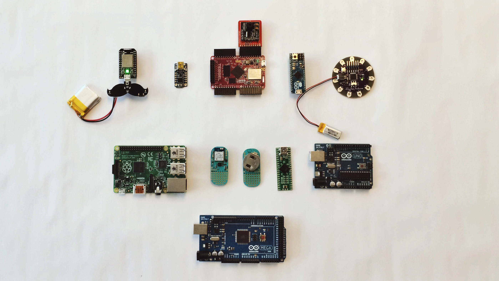
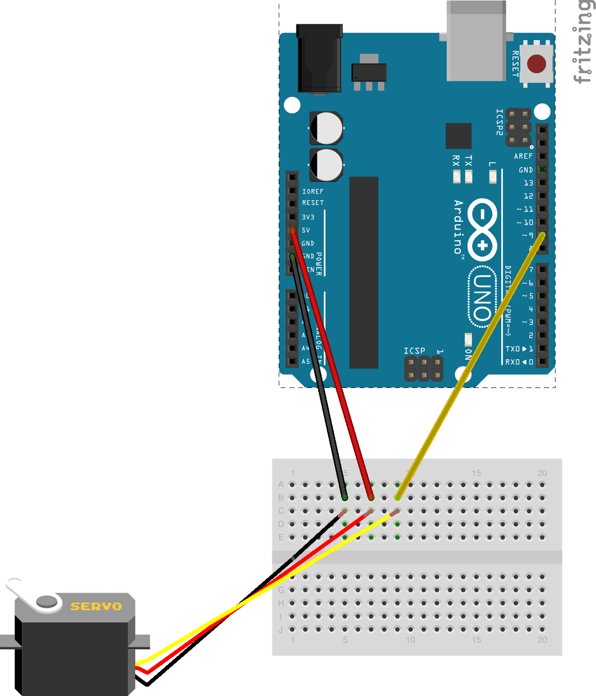
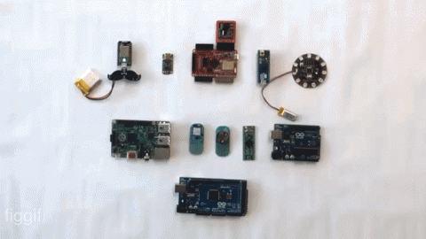

#_Beyond the Slab_

_(or, a beginner shares a little of what he knows regarding hardware hacking)_

^0-5min (5mins)

^Today, I hope to do three things:

^Share a little of my experiences as a software dev being first afraid,  then turned onto hardware hacking

^Convince my fellow software developers that hardware hacking is a necessary endeavour

^Give my fellow software devs some resources to get started.

---
#[fit]👋 who am i?

---


^I'm obviously jm, owner of beats.com and I hold a title of webmaster of Golden Dome Productions in South Bend Indiana

---


#1997😂

---


#[fit]_and yes, i did own, and subsequently sold beats.com in the early 2000s._

---


#[fit]_and yes, i did own, and subsequently sold beats.com in the early 2000s._
#😭

^Just kidding, this was from 1997. And yes, i did own, and subsequently sell beats.com, back in the day. T.T

---


#[fit]I've been writing software for around 20 years. 
 
^I've spent most of my time writing software that runs on the Internet, whether it be CGI in with C then  Perl, Java, Shell scripts, Javascript...I worked for a few years at an e-commerce startup, which eventually brought me to Seattle. 

---

#I was introduced to embedded computing working for a Major Appliance Manufacturer in their research lab.


^We used Java + OSGI bundles then.

---

##_I've been in the Nordstrom Innovation Lab for about 3 years._ 
_We focus on testing things that the business may find too risky to spend a lot on up front, and often try to do it fast._ 

_This means we ~~get to play with~~ test ~~cool~~ nascent technologies and processes every now and then in order to get there._


^We've gone through a few iterations over the years, but basically -- we prototype a lot, whether it be processes, customer experiences, or technologies. We've failed a lot, and have been quite successful and influentual throughout the business. We think this is is because we get to test and validate quickly.

^We tend to frame ideas based on their Desirability -- do customers want it, Viability -- will it make us money at a rate we'd tolerate, and Feasibility -- can we actually do this in a reasonable time. 

^I currently spend most of my time writing code in Javascript, and Objective-C. I've recently started teaching Python so i figured i should learn it as well. We'll actually see a little code here today; it'll be in Javascript, so feel free to head out if this offends. :)

---


_I picked up an Arduino for my kid at Christmas a few years back, thinking, "we'll learn it together", and that i could also try some things out at work._

_We started!_

_We blinked an LED or two, then stopped._

---


#Then, at work, someone asked me to dim some lights.

^I'd watched in wonder as colleagues hacked hardware for experiements, then finally had an opportunity to try it out for a project. I'll talk about that in a second.

^First, a disclaimer: I'm a rank amateur when it comes to hardware hacking, but I do enjoy it, and am thankful that I'm lucky enough to play with hardware at work.

---

#Why hack hardware?

^5-10mins (5mins)

^Why would someone want to spend time hacking hardware?

---

###Because, it's not that hard anymore, and actually fun
  


^Electronics prototyping's been around for a while, but there are a couple of things that have helped make prototyping new again:

^1) proliferation of electronics platforms. Specifically -- Teddy Ruxpin. These platforms have made it so easy to write software to our electronics. Changing the make-up of a creation on the fly is a lot of fun, and makes our hardware more malleable

^2) Support for higher level languages. We're no longer speaking the language of the "Metal", but in languages that we understand

^3) it's less expensive to prototype electronics than in the past.

^We're nearly only limited by our imagination when it comes to the ideas we can actually test! It's never been easier to go from 

^"wouldn't it be cool if" to 

^"let's see if it really would be cool", or 

^"i wonder if we can" to 

^"let's try and build it then"

---


##_Physical Computing_
###_What is it?_

^10-20mins (10mins)

^So, what are we talking about here? Physical Computing Platforms

--- 


##Here's a short list
_Arduino: Uno,Nano,LillyPad,Duemilanove,..., Beaglebone, Beaglebone Black, ChipKit, LightBlue Bean, LPCXpresso, Netduino (.Net Micro Framework!), Parallax Propeller Activity Board, Raspberry Pi, Raspberry Pi B, Seeed Linkit (GPRS even!), Spark Core (OTA programming), Tessel, Teensy, TI LaunchPad, Trinket, Twine, Beacons (Bluetooth)_

^There are so many boards to choose from, and they're all not Arduino.:) Depending on what you want to prototype, you may want a little more to start with, or want a form factor that will work better with what you're doing

---


###_Kinds of devices_
* _Microcontrollers (Arduino & variants)_
* _"Tiny computers” (BeagleBone, Raspberry Pi series)_
* _Wireless microcontrollers (Spark Core, Lightblue Bean, twine)_
* _Language-specific boards (Tessel)_
* _Specialty Boards (LillyPad Arduino is sewable, can be washed)_

^First--about this photo--How powerful are these boards? They are 4~16 times more powerful than the initial IBM PC, and 16~64 times more powerful than the Apollo 11 computer! (http://embeddedcomputing.weebly.com/)

^There are quite a few kinds of devices. I'm not aware of nomenclature that separates them, so i made some up here.

^Classic platforms don't have a full-on computer, but support pushing code to the device. They also are usually modular, and support, in the case of Arduino, shields, and other more full-featured modules. Arduino is important because: 1) it's the one that broke out this movement of hardware hacking for the masses 2) The hardware spec is Open Source, which has led to quite a bit of innovation in the space.

^Mini Computers like BeagleBone, Raspberry Pi series, can run a 3rd party operating system (ChromeOS, Linux, whatever you can stick on it) usually have USB ports, maybe ethernet, and a HDMI output built-in. They're pretty cool because You can do stuff like maybe set up a little database on it, and a web server, or any other thing that a "regular computer" can do (albeit slower of course)

^Sensor based -- vendors have tried to add value by creating devices with sensors in them (mainly because they can). stuff like accelerometers, maybe a light sensor...and many of them support loading programs onto them without having to be tethered. Two mentioned have GPIOs, the Twine (to my current knowlege) has no GPIO, but supports proprietary modules

---

* beacons? (Estimote,Motorola,)
* programmable toys (sphereo, not in scope for this discussion)

^beacons are an entirely separate discussion. :)

^sphereo and the like are toys that do a prescribed set of stuff, and have APIs available. The geekiest among us have taken them apart and augmented their functionality, however, sometimes using some of the above platforms. :)

---

#The key to a legit board -- __GPIO__


<sub>General Purpose Input/Output</sub>
<sub><sub>(anyone remember the BeBox? GEEKPORT!)</sub></sub>

^GPIO is the thing that allows you to talk to the various components you'll end up spending your money on. It separates the sensor-based

---

###_Necessary Skill Sets_


####_The Basics:_

* _Computer hacking skills_
* _Desire skills_
* _Google skills_
* _Asking for help skills_

^Desire -- my hope is that this talk will get you interested enough to want to grab a board and play with it

^Google skills -- Knowing what to ask is always helpful. The more you tinker, the more you'll know what to ask

^I can't stress enough -- if you can find someone who knows this stuff, even if they don't know it thoroughly, and you can pair/work through it together, it makes a big difference.

^I have found that the folk that you usually want to talk to about this, are so into it, that they *love* to talk about this stuff anyway!

---

###Concepts/Considerations 

^20-35mins (15mins)

^Power: voltage (V), current (I) and resistance (r).

---


###_Components/Modules--They behave kinda like software_
* _Components follow composition._ 

^As in software, larger components are made out of smaller components. I mention this because you may find yourself struggling to get a piece of a circuit going, and realize that there's a module (or shield or plate) for that.

^Inheritance? kinda. I mean, there are different kinds of LEDs, Servos, and the like

---


###_Components/Modules--They behave kinda like software_
* _Components follow composition._ 
* _Components have interfaces_

^Like any piece of software, there's an interface, whether it be good or bad.

---


###_Components/Modules--They behave kinda like software_
* _Components follow composition._ 
* _Components have interfaces_
* _Some larger components are standardized, some aren't_

^Sometimes there are standards for either the interface, or the data passed to and from it (i'm thinking about something like a Bluetooth Low Energy component), and sometimes components have proprietary interfaces, just like in the software world. You decide whether or not that's important. I posit that in 

---


###_Components/Modules--They behave kinda like software_
* _There are a lot of larger components available_


^The space is vast enough these days that you'll spend a lot more time dreaming up your idea than doing complex wiring to create a component from scratch (unless that's your thing--then go for it!). 


---


###_Components/Modules--They behave kinda like software_
* _There are a lot of larger components available_
* _Components usually come with corresponding software libraries to interface with these_
 * _cameras, servos, sensors, advanced controllers_


^Each of these components have interfaces to make them *do* something. Much of the time they're standard, but, like in the software world, there are deviations due to varying factors (companies trying to differentiate themselves, skill levels of component makers, opinions of component makers). The specification documentation is your friend! 


---


###Components/Modules--They works kinda like software
* _There are a lot of larger components available_
* _Components usually come with corresponding software libraries to interface with these_
 * _cameras, servos, sensors, advanced controllers_
* _Design, Run, Refactor_

^As with software, you'll design your prototype (usually using drawings/schematics), run it, and learn, maybe fry something, and refactor your design.

---

#Hardware is different than software...
* _More expensive to integrate_

^It takes time to build circuits, more than with software. If you break something, you have to physically replace it. The cost of failure is slightly higher. But when you buy in bulk, this becomes pennies in many cases. Definitely less than hundreds of dollars, as in the past.

---

#Hardware is different than software...
* _More expensive to integrate_
* _It's slightly scarier (and exciting) than software, because you can blow something up_

^Especially when dealing with AC power. Most of the boards you'll encounter, however, will be rooted firmly in DC power. To start, let's stay away from AC power. :-)

---

#Hardware is different than software...
* _More expensive to integrate_
* _It's slightly scarier (and exciting) than software, because you can blow something up._
* _But most parts are kinda cheap_

^On the order of pennies...

---


#[fit]_And heck, you can even use that to your advantage._

---

#Hardware is different than software...
* _Testing *seems* more functional (at least I haven't found a good way to "unit test" components well)_
* _Things you'll eventually want that'll be helpful_
 * _Multimeter_

---


#Hardware is different than software...
* _Testing *seems* more functional (at least I haven't found a good way to "unit test" components well)_
* _Things you'll may eventually want that'll be helpful_
 * _Multimeter_
 *_
* _But for real--you can hurt yourself, so be careful._

^what else, y'all? :)

---

#Hardware Interface Design

* _Who or what is consuming?_

^Sometimes a human will be touching it directly, sometimes it's another system. It's the same with software, so think about that. Granted its more likely when you're prototyping you want someone to play with what you built, so this is when it's useful to maybe study other designs, and even pair with an Industrial designer (or someone with that background) to chat about this stuff (they're easier to find than you think...well for me?:) -- at least you now know what to Google.

---

#Hardware Interface Design

* _Who or what is consuming?_
* _How much coupling can you tolerate?_

^Sometimes a human will be touching it directly, sometimes it's another system. It's the same with software, so think about that. Granted its more likely when you're prototyping you want someone to play with what you built, so this is when it's useful to maybe study other designs, and even pair with an Industrial designer (or someone with that background) to chat about this stuff (they're easier to find than you think...well for me?:) -- at least you now know what to Google.

^With any prototyping, there's a question of fidelity...there are plenty of things you can just throw together (like for todays demo ;-) or you'll need to put something together to put in front of customers to test. [some rules of thumb here--talk to UX folk]

---

#Software Interface Design

* _Who or what is consuming?_

^If it's a human consuming, you'll want to have a nice mobile or desktop interface no?

^If it's another machine, you'll have to think of the data format. 

---

#Software Interface Design

* _Who or what is consuming?_
* _How much coupling can you tolerate?_

---

#Software Interface Design

* _Who or what is consuming?_
* _How much coupling can you tolerate?_
* _HTML, Mobile native? Data Driven?_

^You'll make some of the same decisions as with any other kind of software. Will your users want to interact via a large or small screen? Via a particular platform, using a particular protocol? Maybe there's no visual UI and it's data that gets sent as a result of a button push...

---

#Software Interface Design

* _Who or what is consuming?_
* _How much coupling can you tolerate?_
* _HTML, Mobile native?_
* _Data format? (JSON,XML,Your own...)_

^Many times devices have to pass data. I lean towards JSON because there are libraries in nearly any language to cleanly parse this data into objects, but maybe you have other considerations, i.e. existing compatibility, message size requirements, that influence your data format. It's all good

---

Wanna see something IRL?


^35-45mins (10mins)
^So, back to the light dimmer. I got a request to do some kind of automatic dimming of a light when someone walked into a room.

^Yeah we coulda purchased a Phillips Hue system, but we weren't sure if we wanted to do this. This was an opportunity to build to learn. So, like macguyver, we were like "lightbulb, dimmer, arduino, what can we do". 

^I have the luck to share the lab with an industrial designer, and an electric geek, so they were able to help me wire a dimmer, and create a simple case that would mount a servo on a dimmer to turn it, like a baby robot!

---



```javascript
var five = require("johnny-five"), 
    board = new five.Board();
var program = require('commander');
var keypress = require('keypress');

program
  .version('1.0.0')

board.on("ready", function() {
  console.log("board ready. left right arrow keys, 'q' to quit.");
  var servo = new five.Servo({
    "pin": 11,
    "startAt":program.startAt
    });
  process.stdin.on('keypress', function (ch, key) {
    // console.log('got "keypress"', key);
    if (key && key.name == 'right') {
      servo.to(0);
    }
    if (key && key.name == 'left') {
      servo.to(180);
    }
    if(key && key.name == 'q') {
      process.exit(0);
    }
  });

  process.stdin.setRawMode(true);
  process.stdin.resume();
});
```

^oh yeah we're at code camp, right? I used a library, Johnny Five, which allows us to talk to Arduino via Javascript. This code's on my GitHhub.

---

#Other ways I could have done it
* _Work directly with AC -- but did you not hear what i said above?_
* _Used LED Lighting, MOSFET or somesuch to boost electricity needed_

^I'm personally not ready to work with AC unattended. But plan on it, one day.

^LED Lighting is relatively easy to light from one of these boards, with the help of something to give us enough power to run a bunch of it. 

---

#Door Unlock Mechanism
* _12VDC Solenoid_
* _12V Power supply hacked to plug into_
* _Tessel Relay Module_
  * _originally built a relay from scratch, but it was messy, and burnt up, but it's possible for people who can properly implement that thing to the right_


^The thing with BCE is a transistor, the zigzags are resistors, and the curlycue is a solenoid, with a diode thrown in so that things don't spark when we throw power at the diode. That's the part I messed up. I think i used too small of a diode or somesuch. That is for a later learning, because I was trying to build a door switch, not necessarily reinvent the relay. Tradeoffs!

---


```javascript
var router = require('tiny-router'),
    tessel = require('tessel'),
    relaylib = require('relay-mono');

var relayOpenDefault = 3000;
       
var relay = relaylib.use(tessel.port['A']);  

[...]

relay.turnOn(1,function turnOnResult(err){
  [...]
}

[...]

relay.on('ready', function relayReady () {
    router
        .get('/unlock',function(req,res) {
                unlock(req,res,relay);
        });

    router.use('static', {path: __dirname + '/public'});

    setTimeout(function(){
        router.listen(80);
    },5000)
});
```

^So, let's talk about this for a second. Tessel is cool in that it runs javascript. I know javascript! You want to keep your code pretty small, but still quickly get work done, so i used a tiny-router module to expose endpoints that would do the main function of unlocking.

^I declare my relay class with the relaylib line, it emits 'ready' when ready, and then i set up my endpoint. When it comes time to turn on the relay, the API is super straightforward: relay.turnOn()

^Note the static path. The UI front end you see is a web page with a little Javascript to make an Ajax call to this web service.

---


```javascript
<html>
  <head>
  <meta name="viewport" content="width=device-width, initial-scale=1.0, maximum-scale=1.0, user-scalable=no" />
  <meta name="apple-mobile-web-app-capable" content="yes">
  <link rel="stylesheet" href="/css/main.css">
  <link rel="stylesheet" href="/css/rad.css">

  <title>Unlock this door</title>
  </head>
  <body>
    <div class="container">
      <div id='radial-progress' class="progress-radial progress-step-0">
        <div class="overlay" id="radial-progress-overlay" onclick='runProgress()'>locked</div>
      </div>
    </div>
  </body>
</html>
<script type='text/javascript'>
  var relayOpenDefault = 4000;
  var setProgress = function(element,i) {
    // console.log("set progress: " + i);
    var progress = document.getElementById('radial-progress');
    var progressMessage = progress.children[0];
    if(!(i%5)) {
      progress.className = 'progress-radial progress-step-' + i;
      // progressMessage.innerHTML = i + '%';
    }
    if(i>=100) progressMessage.classList.add('complete');
  }

  var runProgress = function() {
    resetProgress();
    var i = 0;
    var progress = setInterval(function(){
      setProgress('progressbar',i++);
      if(i == 101) {
        clearInterval(progress);
      }
    },1);          
  }

  var resetProgress = function() {
    var progress = document.getElementById('radial-progress');
    progress.className = 'progress-radial progress-step-0';
    var progressMessage = progress.children[0];
    progressMessage.classList.remove('complete');
    progressMessage.innerHTML='locked';
  }

  xmlhttp=new XMLHttpRequest();
  xmlhttp.onreadystatechange=function()
  {
  if (xmlhttp.readyState==4 && xmlhttp.status==200)
    {
      var progressMessage = document.getElementById('radial-progress').children[0];
      progressMessage.classList.add('complete');
      progressMessage.innerHTML=xmlhttp.responseText;
      setTimeout(function(){
         resetProgress();
      },relayOpenDefault)
    }
  }
  var unlockDoor = function() { 
    runProgress();

    document.getElementById("radial-progress-overlay").innerHTML='...';
    xmlhttp.open("GET","/unlock",true);
    xmlhttp.send();
  }

  var el = document.getElementById('radial-progress-overlay');
  el.addEventListener('click', unlockDoor, false);
  el.addEventListener('touchstart', unlockDoor, false);
</script>
```

^I used Good Old Fashioned Javascript (no fancy libraries) for the front end, to keep it as lean as i could. It's messy, and could use some refactoring, surely, but remember: PROTOTYPE :)

---

#Other ways I could have done it
* _Use Raspberry Pi or BeagleBone, add a DB to store/sync unlock codes with a central service_

^I haven't tried sticking a DB on one of these yet, so dunno about performance. Furthermore, the tessel could have made external calls to a service for this functionality as well

---

#Other ways I could have done it
* _Use Raspberry Pi or BeagleBone, add a DB to store/sync unlock codes with a central service_
* _Use Bluetooth module instead of Built-in WiFi_ (but i was cheap, and in learning mode)

---

#Other ways I could have done it
* _Use Raspberry Pi or BeagleBone, add a DB to store/sync unlock codes with a central service_
* _Use Bluetooth module instead of Built-in WiFi_ (but i was cheap, and in learning mode)
* _These other ways depend on what i was trying to accomplish..._

^Which leads me to...

---


#Refining your Prototype
* _Who is your audience?_
* _Where will it live?_
* _How much more time do you have?_
* _Is Duck tape GEFN?_
* _Often, you'll want to move to PCB while you're still prototyping_

^You'll want to think about your audience when you decide whether or not to refine your prototype. In our case, for the Light Bulb, we wanted people to kind of hear the servo (for whatever reason we thought that was cool), but wanted to hide some key pieces to not make it look too shoddy. We also didn't want to cause an accident in front of our audience, so it was important to encase the dimmer in the proper enclosure!

^3D printing is a fantastic luxury for helping you shape up your prototypes.

^There are services that will help you get from prototype to batch production, when you're ready.

---


####Things that will learn along the way, and will become more important
* _How to draw and read schematics_
* _Shields_, _Capes_, _Plates, oh my (also, Modules)_
* _Component foo_
  _<sub>capacitors, diodes, resistors, MOSFETs, all that jazz, and why they're important. You'll run into some earlier than others. Hint: learn resistance first</sub>_
* _How to make your creation self-contained_
  * _Look into ATTiny_
  * _External Power Supplies_

---


#My recommendations 👍
* Grab an Arduino (Uno or Mini) _Kit_  to start
* Maybe Try out TI Launchpad -- Free stuff
* If you're into Javascript, grab a Tessel
* Find a local group!
* Do it. 

^Grab an Arduino (Uno or Mini) _Kit_  to start. Kits usually come with breadboard,LEDs,few other components, and usually a book
^Maybe Try out TI Launchpad. TI has a habit of providing samples for free, because they love eventually selling in bulk
^If you're into Javascript, grab a Tessel. It's my current personal favorite because of the built in Wifi, and modules. It's just easy quick to get stuff running on it.
^There's a board (and/or module) that'll give you the size and features you need.
^There are several "maker" meetups in the area, and places in the area to go and build. You'll want to look up "Maker spaces"

---

#Resources
* _Learning Stuff:_ 
  * _http://www.allaboutcircuits.com/_
  * _Youtube, duh_
* _Buying stuff: _Adafruit_, _SparkFun_, _Seeed Studio_
* _Metrix Create Space_
* _http://iot.ieee.org/_


^"Make" has a great Youtube channel, but there are so many hobbyists showing off their projects, you'll find what you need.

^Notice i haven't said the words "Internet of Things" much. Sorry. :) This last link may be a good place to keep abreast of what's happening in this world that you've begun o dabble in.

^NyTec Innovation Center

---

#Libraries/Toolkits
* _Johnny-Five_ (Javascript)
* _CylonJS_
* _RPi.GPIO_ (Python)
* _Netduino speaks .Net micro framework_
* _Fritzing for creating and sharing sketches and schematics_

---

#Questions?

---

#Shouts to my lab folk
* Paul Payne
* Mark Selander
* Cheri Thompson
* Brett Wagner
and of course
* Nordstrom 
<sup>(Lab's hiring, like everyone else ;-)</sup>
